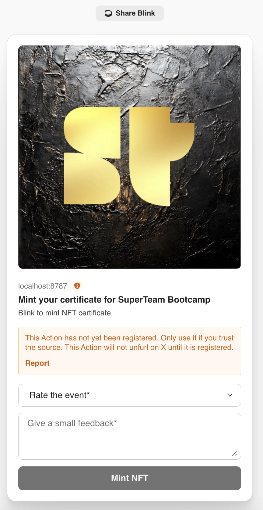

# Superteam Bootcamp Feedback & NFT Minting Platform


## Project Overview

This project is a comprehensive Solana-based platform that combines NFT minting via Candy Machine with a user feedback system, leveraging Dialect Blinks for an interactive user experience.

## Key Features

### 1. NFT Minting Candy Machine
- Deployed using Metaplex Core Candy Machine
- The NFT collection is made of 1k unique NFTs
- Configurable minting rules:
  - Mint limits (max one per wallet)
  - Bot tax protection
- Pre-configured with collection metadata (uploaded on arweave.net)
- Supports devnet deployment

### 2. Feedback Mechanism
- Solana Anchor program to capture user feedback
- Allows users to:
  - Rate experience (1-5 stars)
  - Submit detailed comments
- Uses Program Derived Addresses (PDA) for secure feedback storage

### 3. Dialect Blinks Integration
- Web API for interactive NFT minting
- Feedback collection before NFT mint
- Supports star rating and comment submission
- The Minted NFT is a unique certificate for the event participation with the logo of SuperTeam, a background image, and a spotify code for a techno music (Berlin vibes!)

## Technical Stack

- **Blockchain**: Solana
- **NFT Framework**: Metaplex
- **Backend**: 
  - Rust (Solana program)
  - Anchor
  - TypeScript (Node.js)
- **Deployment**: Local (but can be in Cloudflare Workers)
- **Uploader**: Irys (for metadata and images to be deployed on arweave.net)

## Project Structure

```
.
├── src/
│   ├── helpers/
│   │   ├── createCandyMachine.ts   # Candy Machine setup
│   │   ├── uploadMetadata.ts       # Metadata and image uploader
│   │   └── test.ts                 # Minting test script
│   └── index.ts                    # Blink API considering both feedback and minting of NFT
├── solana_feedback_program/
│   ├── programs/
│   │   └── superteam-bootcamp/
│   │       └── src/
│   │           ├── instructions/   # Solana program instructions (Feedback)
│   │           └── state/          # Program state definitions
│   └── tests/                      # Test scripts
└── worker-configuration.d.ts       # Cloudflare Workers configuration
```

## Setup and Deployment

### Prerequisites
- Solana CLI
- Anchor
- Rust
- Node.js
- Devnet SOL tokens

### Steps
1. Clone the repository
2. Install dependencies
   ```bash
   npm install
   ```
3. Configure wallet (wallet.json for Anchor program)
4. Upload metadata and images
   ```bash
   npm run src/helpers/uploadMetadata.ts
   ```
5. Create Candy Machine
   ```bash
   npm run src/helpers/createCandyMachine.ts
   ```
6. Deploy Solana program (anchor build, anchor deploy)
7. Start the API server (Blink)
   ```bash
   npm run dev
   ```
7. (Optional) Deploy Cloudflare Worker

## Environment Configuration

- Uses Solana Devnet for testing
- Irys protocol used for decentralized storage on arweave
- Configurable via `wallet.json` and environment variables

## Security Features

- Mint limit guards
- Bot tax protection
- PDA-based feedback storage
- Minimal required permissions

## Future Improvements

- Migrate to Solana Mainnet
- Enhanced feedback analytics (leaderboard)
- Additional NFT minting rules
- Improved error handling

## Challenges

- First Exposure to Web3: Team's initial venture into Solana ecosystem, blockchain technology, and new development frameworks
- Language and Framework Challenges:
  - Learned Rust, with its unique safety and performance features
  - Adapted to Anchor's blockchain program abstraction
  - Blinks
- Learning Under Pressure:
  - Rapid knowledge acquisition within a limited timeframe
  - Navigated the steep learning curve from theory to practical application
  - Developed skills in debugging and testing on a live blockchain